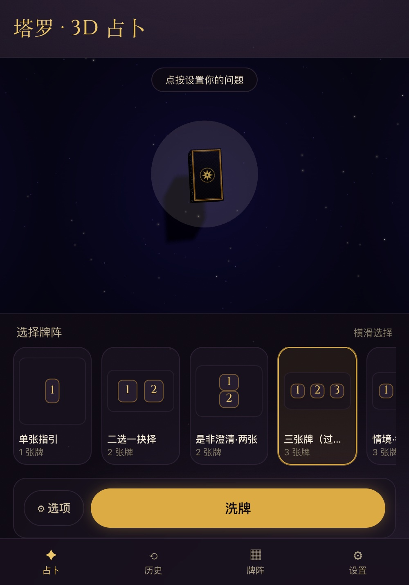
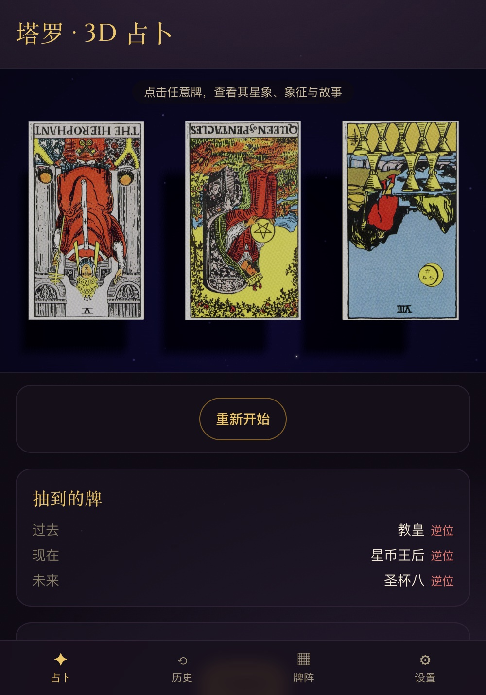
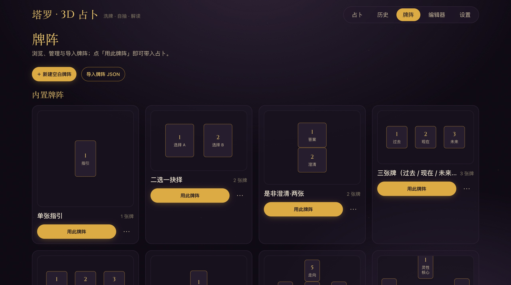
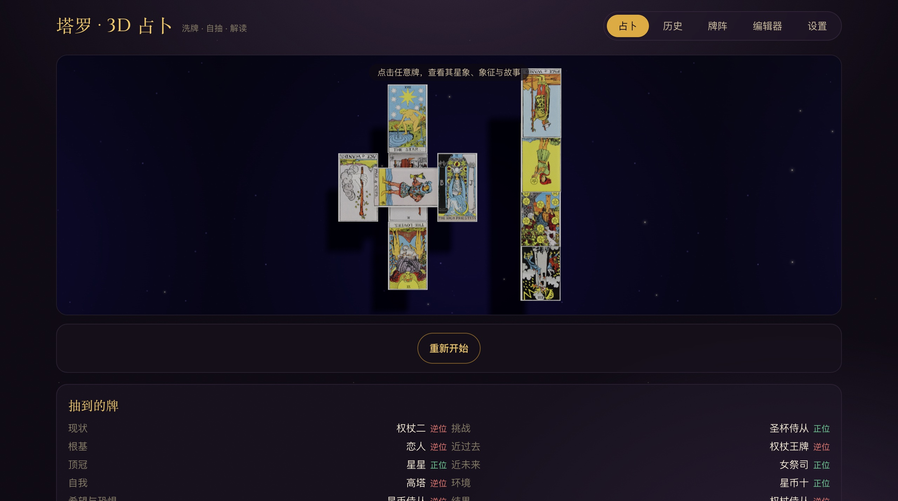
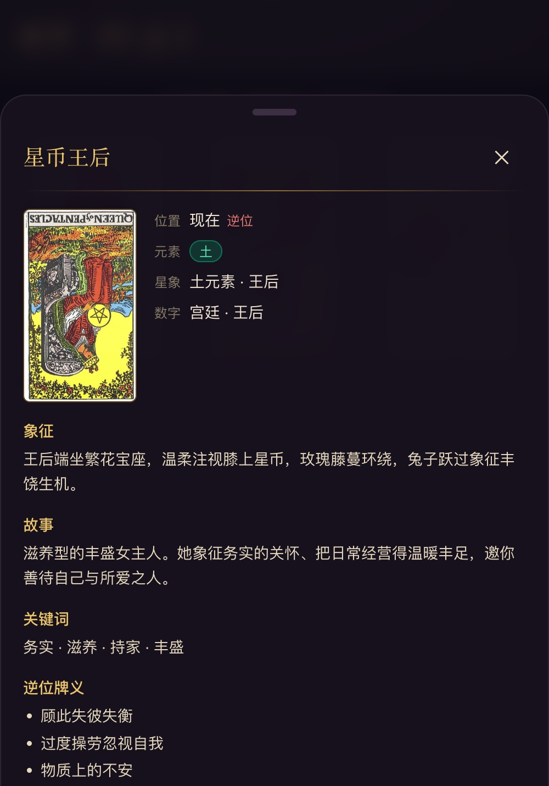

<div align="center">


# 塔罗 · 3D 占卜

**A 3D tarot table in your browser — shuffle, draw your own cards, and let your own LLM read the spread.**

Pure front-end · no backend · bring-your-own model key · Chinese-first.

<p>
<a href="https://anois.github.io/tarot/"></a>
</p>

<sub>
<a href="https://tarotj.oss-cn-beijing.aliyuncs.com/">CN mirror</a> ·
<a href="LICENSE">MIT</a> ·
<a href="README.zh-CN.md">中文</a> ·
<a href="https://github.com/anois/tarot/issues/new">Request a feature →</a>
</sub>

</div>

---

**塔罗 · 3D** is a tarot divination web app that runs entirely in your browser — no backend, no accounts, no telemetry. Shuffle a crypto-grade deck on a candlelit 3D table, then **draw your own cards** (they are never auto-dealt — you scrub the ribbon and tap the one you want), watch each fly into its place in the spread and flip face-up, with reversed cards turned 180°. Bring your own LLM key (**BYOK**) and the browser packs your question + the spread + the drawn cards (with orientations) + each card's meaning into a structured prompt and streams an interpretation back — entirely in Simplified Chinese. Your key talks straight to the provider you chose; nothing passes through a server we run.

## Draw your own cards — a real 3D table

The whole reading lives on one immersive screen. The deck is the hero: tap it (or **洗牌**) to shuffle, swipe the ribbon to browse face-down cards, and tap the centered one to draw it into the next slot. When the reading is revealed the camera eases in and frames the board. The card you picked is literally the mesh that flies up and flips — no sleight of hand.

<table>
  <tr>
    <td width="50%" align="center"></td>
    <td width="50%" align="center"></td>
  </tr>
  <tr>
    <td align="center"><sub>Idle — deck hero, swipeable spread picker, candlelit CTA</sub></td>
    <td align="center"><sub>Revealed — board centered & framed, drawn-card list</sub></td>
  </tr>
</table>

## 14 spreads — from a single card to the zodiac wheel

Built-in spreads cover single-card, two-card decision / yes-no, three-card timelines, mind-body-spirit, relationship, pentagram, horseshoe, chakra column, Celtic Cross, the 12-house zodiac wheel, and the year-ahead ring. Every spread is described in one normalized `[0,1]` coordinate system shared by the 2D preview, the 3D board, and the visual editor — so you can also **import / export spreads as JSON** or **drag out your own** in the editor, and they render identically everywhere.

<p align="center"></p>

## Bring your own key — the browser talks straight to the model

There is no server in the loop. You paste your **own** API key in Settings (kept in memory by default; opt-in to session/localStorage), and the browser calls the model directly. **DeepSeek** is the verified browser-direct default; **OpenRouter** is the wildcard-CORS fallback; Anthropic-native and any OpenAI-compatible endpoint are supported too. Pick from five reading styles — structured card-by-card, narrative, quick answer, whole-board synthesis, and a deep-dive follow-up that remembers the drawn cards — and the response streams in as Markdown. Readings auto-save to IndexedDB (history is yours, on-device, exportable), and you can mint a `#cfg=` share link so a friend without a key can try it.

<p align="center"></p>

## Every card, fully in Chinese

Tap any revealed card for a detail sheet: element, Golden-Dawn astrology, numerology, authored symbolism & story, curated keywords, and orientation-appropriate meanings — all in Simplified Chinese. A position-aware button asks the model what this card means *in this position, for this question*; the whole-board template reads the spread's overall shape (element balance, upright/reversed ratio, Major-Arcana density, dominant/absent element).

<p align="center"></p>

## Getting a model key (DeepSeek)

The app ships no key — you bring your own. To get a DeepSeek key:

1. Sign up / sign in at the **[DeepSeek open platform](https://platform.deepseek.com/)** (phone or email).
2. Open **API keys → Create new API key** and copy it — it's shown only once.
3. **Top up** a small prepaid balance under **Billing / 充值**. The balance *is* your spending cap (DeepSeek has no per-key limit), so a few yuan is plenty for personal readings; new accounts may get trial credit.
4. In the app: **Settings → provider: DeepSeek → paste the key → 测试连接 (test connection)**. DeepSeek is verified to work browser-direct.

> **Sharing safety:** a `#cfg=` link embeds your key and spends *your* balance. Since DeepSeek caps spend only by the account balance, share only with a small balance + a dedicated, deletable key — or use an **OpenRouter** key with a per-key credit limit instead.

## What's inside

| Axis | What's there |
|---|---|
| **3D table** | One unified deck of meshes: crypto-grade Fisher–Yates shuffle → coverflow browse → **you draw** → fly into slot → flip in place (reversed = 180°). Candlelit "grimoire" theme, drop shadows, sparkles, camera framing on reveal, reduced-motion + mobile perf tiers. |
| **Drawing** | You pick your own cards (never dealt); LIFO undo before confirm; per-card independent reversed coin decided after the shuffle. Major-Arcana-only mode. |
| **Spreads** | 14 built-ins + JSON import/export + a visual drag editor; one normalized `[0,1]` convention shared by 2D preview / 3D board / editor; Zod-validated with cross-field invariants. |
| **LLM (BYOK)** | OpenAI-compatible client, DeepSeek (browser-direct) default + OpenRouter fallback + Anthropic + custom; SSE streaming; 5 templates incl. whole-board synthesis & deep-dive; CORS errors classified with a "switch to OpenRouter" hint. |
| **Reference** | 78-card RWS deck + authored Chinese element / astrology / numerology / symbolism / story + curated Chinese keywords & upright/reversed meanings. |
| **Local** | IndexedDB history (auto-saved, export/import), persisted appearance prefs, `#cfg=` config share-link (key lives only in the URL fragment, never sent to a server). |
| **Surface** | Mobile-first: bottom tab bar, immersive single-flow, bottom-sheet controls, ≥44px touch targets, `svh` + safe-area; desktop gets the top nav and a wider table. |

## Run it locally

```bash
git clone https://github.com/anois/tarot.git
cd tarot
pnpm install
pnpm dev          # → http://localhost:5173 (or 5174)
pnpm test         # vitest (unit tests)
pnpm lint         # eslint
pnpm build        # tsc typecheck + production build
```

For local-dev convenience you can pre-fill the key box from `.env` (`VITE_DEV_LLM_*`, see `.env.example`) — this is read **only** under `pnpm dev` and is dead-code-eliminated from production builds, so no key ever ships in the bundle.

- **Architecture** (the divination store as single source of truth, the unified 3D deck, the shared normalized spread coordinates, the BYOK LLM client + SSE parsers, prompt assembly) → [`CLAUDE.md`](CLAUDE.md)
- **Deployment** (GitHub Pages workflow + Aliyun OSS China-mirror, base-path handling, SPA fallback) → [`docs/deploy.md`](docs/deploy.md)

`pnpm build` emits a static `dist/`; pushing to `main` auto-deploys to **GitHub Pages** and an Aliyun OSS China mirror at <https://tarotj.oss-cn-beijing.aliyuncs.com/>.

## 🤖 Maintained by Claude Code

**Every commit in this repository is produced by a [Claude Code](https://claude.com/claude-code) session.** The 3D engine, shuffle math, spread definitions, LLM client, UI, CSS, i18n strings, this README — there is no human-authored line of code in the visible history, and there isn't supposed to be. This is the project's actual operating model, not a marketing flourish.

- **Human-authored PRs are not part of the workflow — please don't open one; it won't be merged.** The single committer identity for this repo is the Claude Code maintenance pipeline.
- **The input channel is [GitHub Issues](https://github.com/anois/tarot/issues/new).** Plain prose is fine — Chinese or English, a few lines describing what you'd like or what's broken. Reasonable issues get picked up, handed to a Claude Code session that implements + tests + opens the PR, and (after the maintainer's local acceptance) merges + auto-deploys.
- **Auditable:** the commit history is the audit trail, and each PR description documents why a change shipped.

## License

- **App source:** [MIT](LICENSE).
- **Card art:** the Rider–Waite–Smith deck under `public/deck/` is in the US public domain. ⚠ Before any public deployment, verify the scans are the **1909 edition** (not the still-copyrighted 1971 U.S. Games recolor) or swap to a confirmed CC0 set — the `imageKey ↔ filename` mapping is stable, so the art is a drop-in replacement. See [`public/deck/LICENSE.txt`](public/deck/LICENSE.txt).
- **Card meanings dataset:** [`dariusk/corpora`](https://github.com/dariusk/corpora) (CC0).
- **Display font:** Cinzel — [SIL Open Font License 1.1](https://fonts.google.com/specimen/Cinzel).
- "Rider-Waite" is a U.S. Games trademark; this project is **not** branded as that mark.

---

<div align="center">
<sub><a href="https://github.com/anois/tarot">github.com/anois/tarot</a> · every line shipped by <a href="https://claude.com/claude-code">Claude Code</a></sub>
</div>
